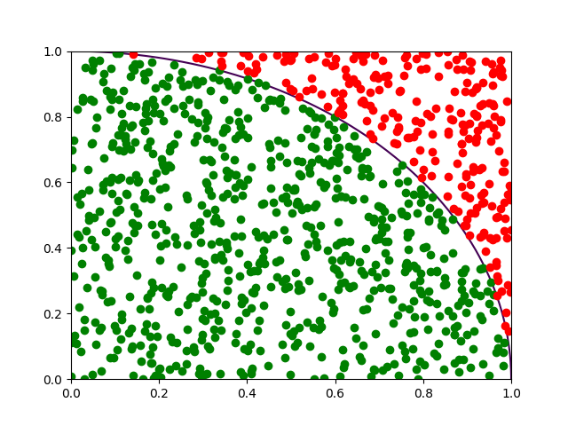

# Estimate PI with random points

Using python and the random module we can calculate the constant PI.

This can be done generating x and y random numbers to create points, calculate the distances this points have to an assumed
origin (0,0), and see which ones have a distance larger than 1.

The ones that do have a distance larger than 1, will be represented with red, the others with green.

 

Once we have those points, we compute the ratio between the number of points that turned to be inside the circle and the total
number of points. That ratio multiplied by 4 will give us the desired estimation of the number PI.
